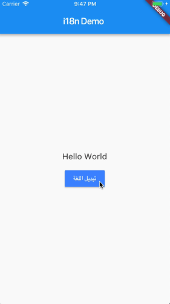

# i18n Demo

A Flutter app that shows internationlizations (i18n) and how to switch between different langagues, and using translated texts for Widgets.

**_It does not use Dart's intl package_**, instead it uses all of its translations directly in per language Maps (I saw it much cleaner than using Dart intl to generate translation strings).

### Credits
[Flutter-Arabic-RTL-Internationalization
](https://github.com/moesaeed/Flutter-Arabic-RTL-Internationalization)
